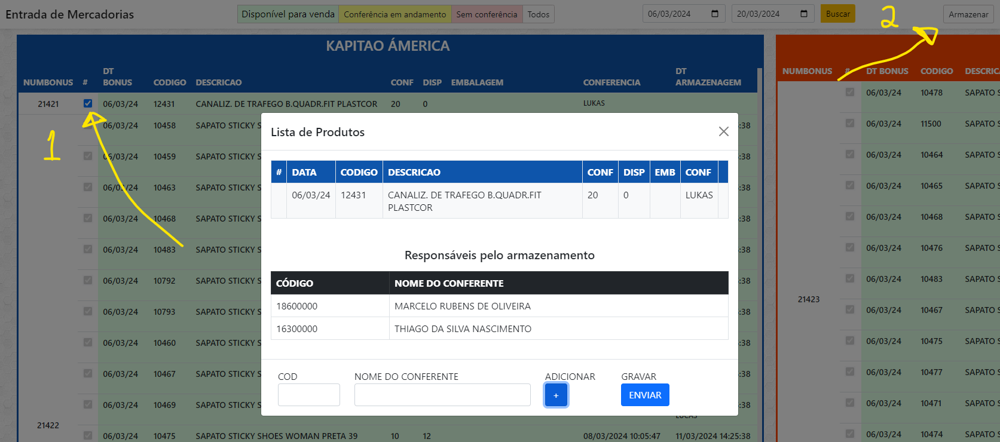

  <h1>Entrada De Mercadoria</h1>
  
Sistema para verificar a entrada das mercadorias realizados na rotina 1106 (PCBONUS, PCBONUSI) com a possibilidade de filtros de data e por status de bônus e produtos.
  
    
  
  <strong>Integração esta feita no ERP Winthor - TOTVS.</strong>

  
  
   
  
  
 

 

Este sistema esta integrado ao Winthor da TOTVs e puxa os dados adicionados da rotina 1106 (PCBONUS, PCBONUSI).

Sistema de Entrada de Mercadoria com visualização de tempo das equipes de EMBALAGEM, CONFERENCIA e ARMAZENAGEM. 

Desta forma o vendedor e todos da empresa conseguem saber quais produtos estão entrando nas lojas e assim consegue avisar aos clientes.

 

### Funções
- [x] Criar no topo a opção de filtrar por data. (default -15 dias)
- [x] Filtros: Disponível, Conferência, Sem Conferencia, Todos

 

### Armazenar Bonus
Tenha controle dos itens armazenados no estoque após o a conferencia da equipe de entrada (1106)

 

##### Criação de Tabela
É necessário criar a tabela IWBONUSARMAZENAR no Oracle para o sistema possa gravar a data de armazenazem e os separadores.

>> 
    CREATE TABLE iwbonusarmazenar (
        dtarmazenagem DATE,
        codprod NUMBER,
        numbonus NUMBER,
        codseparador1 NUMBER,
        codseparador2 NUMBER,
        codseparador3 NUMBER,
        codseparador4 NUMBER
    );

 

##### Criação de Trigger
Essa trigger deve ser criada na table PCBONUSI e ao realizar o checkout na rotina 1106 ele captura os dados necessários

>>
    CREATE OR REPLACE TRIGGER trg_insert_update_iwbonusi
    AFTER INSERT OR UPDATE OR DELETE ON PCBONUSI
    FOR EACH ROW
    BEGIN
        IF INSERTING OR UPDATING THEN
            BEGIN
            
                UPDATE iwbonusi
                SET codconferentes = :NEW.codagregacao,
                    dtinicioemb = CASE WHEN :NEW.codagregacao IS NOT NULL AND dtinicioemb IS NULL THEN SYSDATE ELSE dtinicioemb END
                WHERE numbonus = :NEW.numbonus
                AND codprod = :NEW.codprod;

                IF SQL%NOTFOUND THEN
                    INSERT INTO iwbonusi (numbonus, codprod, dtinicioemb, codconferentes)
                    VALUES (:NEW.numbonus, :NEW.codprod, CASE WHEN :NEW.codagregacao IS NOT NULL THEN SYSDATE END, :NEW.codagregacao);
                END IF;
            END;

            IF :NEW.qtentrada = 1 AND :NEW.qtentrada <> :NEW.qtnf THEN
                UPDATE iwbonusi
                SET dtinicioconf = SYSDATE
                WHERE numbonus = :NEW.numbonus
                AND codprod = :NEW.codprod
                AND dtinicioconf IS NULL;
            END IF;

            IF :NEW.qtentrada = :NEW.qtnf THEN
                UPDATE iwbonusi
                SET dtfinalconf = SYSDATE
                WHERE numbonus = :NEW.numbonus
                AND codprod = :NEW.codprod;
            END IF;
        END IF;

        IF :NEW.qtentrada = 0 AND :NEW.qtavaria = 0 AND :NEW.qtentun = 0 AND :NEW.qtentcx = 0 
            AND :NEW.qtavariaun = 0 AND :NEW.qtavariacx = 0 
            AND :NEW.dtvalidade IS NULL AND :NEW.codmotivo = 0  THEN
            DELETE FROM iwbonusi
            WHERE numbonus = :NEW.numbonus;
        END IF;
    END;

 

#### Tecnologias usadas no projeto
- PHP
- HTML / CSS / JAVASCRIPT
- Jquery
  